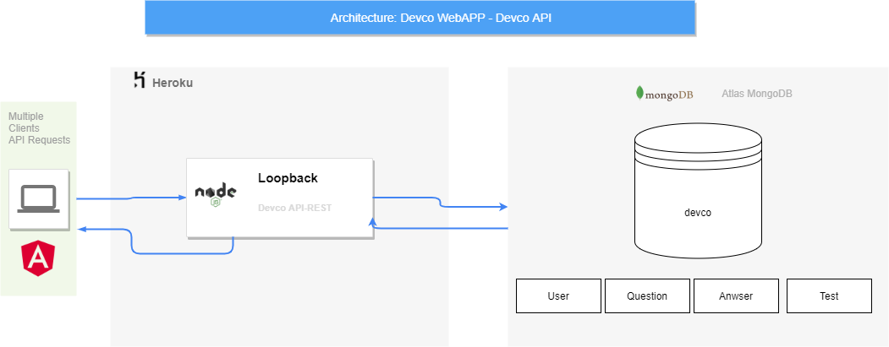
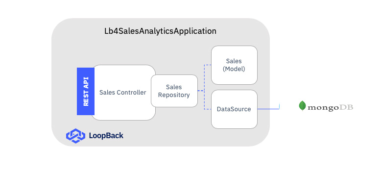
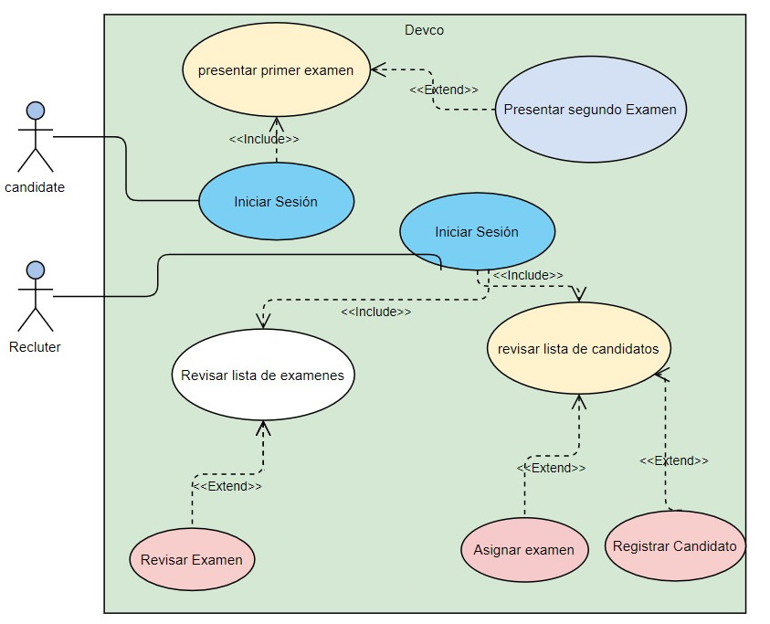

# Devco

This project was generated with [Angular CLI](https://github.com/angular/angular-cli) version 12.0.1.

## Architecture

Para este proyecto se tiene planeada la suigiente arquitectura.

### FrontEnd

el front como se muestra esta sobre un cliente angular que nos permite el desarrollo de manera rapida, tambien se implementó la liberia de angular material para los estilos y thema que se visualizan, para lograr un diseño responsive se incluyo la modulo de fexboxlayout para hacer un diseño ajustable a la pantalla.
El front tiene los suguientes modulos:
1. modulo de logeo que le permite al usuario iniciar sesión.
2. modulo de home donde seran redirigidos los usuarios que iniciarion sesión.
3. modulo de candidato donde se tomaran los test que esten disponibles.
4. modulo de relutador donde se podra agregar un candidato y asignarle uno o mas test.

### Backend
por parte del backend se impletemto una api node js utilizando un framework loopback 4  lo puedes ver en el siguiente repositorio [DevCo-Back](https://github.com/zurimokato/devco-backend), este se encuentra desplegado en un entorno de heroku, se puede consultar en el seguinete enlace [BackenHeroku](https://devco-back.herokuapp.com/explorer/).
en el backend tenemos lo suigente:
1. modulo de autorización que le permite al usuairo identificarse en con la app mediante token jtw en este modulo se implementa todo lo conviniente con el logeo y authorización del usuario, se agregan opciones de restuaracion de contraseñas pero este no se tuvo en cuenta en el alcance de la app final por lo que no se implementó vista.
2. los Cruds de las entidasdes de negocio para lo cual se sigue un modelo vista controlador siguiendo el marco de loopback como se muestra en la siguiente imagen.

  

#### Controlador: 
una clase que implementa operaciones definidas por la API REST de la aplicación. Implementa la lógica empresarial de una aplicación y actúa como un puente entre la API HTTP / REST y los modelos de dominio / base de datos. Un controlador opera solo en entradas procesadas y abstracciones de servicios / bases de datos de back-end.

#### Ruta:
el mapeo entre la especificación de su API y una operación. Le dice a LoopBack qué operación invocar () cuando se le da una solicitud HTTP.

#### Modelo:
La definición de un objeto con respecto al malabarista de la fuente de datos. El módulo @ loopback / repository proporciona decoradores especiales para agregar metadatos a clases de TypeScript / JavaScript para usarlos con DataSource Juggler. Además, el módulo @ loopback / repository-json-schema usa los metadatos de los decoradores para construir un esquema JSON coincidente.

#### DataSource:
una configuración con nombre para una instancia de Connector que representa datos en un sistema externo.

#### Repositorio: 
un tipo de servicio que representa una colección de datos dentro de una fuente de datos.

### base de datos

la base de datos que se utiliza es una base de datos no relacional en mongodb de igual manera que el backend la base de datos corre sobre un cluster de atlas haceindo que todo el backend este desplegado 100% en la nuve.

## casos de uso 

  

 para probar la aplicacion se tienen dos usuarios con diferentes roles.
 
 ### candidato:
 se tiene un usuario candidato con la suguientes credenciales email `candidate1@gmail.com`. y la contraseña es `12345678`. este tiene un test asignado
 
 
 ### recruiter:
 se tiene un usuario candidato con la suguientes credenciales email `admin1@gmail.com`. y la contraseña es `12345678`. este usuario puede ver los candidatos agregar uno y enviar asignar los test. 

## Development server

Run `ng serve` for a dev server. Navigate to `http://localhost:4200/`. The app will automatically reload if you change any of the source files.

## Code scaffolding

Run `ng generate component component-name` to generate a new component. You can also use `ng generate directive|pipe|service|class|guard|interface|enum|module`.

## Build

Run `ng build` to build the project. The build artifacts will be stored in the `dist/` directory.

## Running unit tests

Run `ng test` to execute the unit tests via [Karma](https://karma-runner.github.io).

## Running end-to-end tests

Run `ng e2e` to execute the end-to-end tests via a platform of your choice. To use this command, you need to first add a package that implements end-to-end testing capabilities.

## Further help

To get more help on the Angular CLI use `ng help` or go check out the [Angular CLI Overview and Command Reference](https://angular.io/cli) page.
